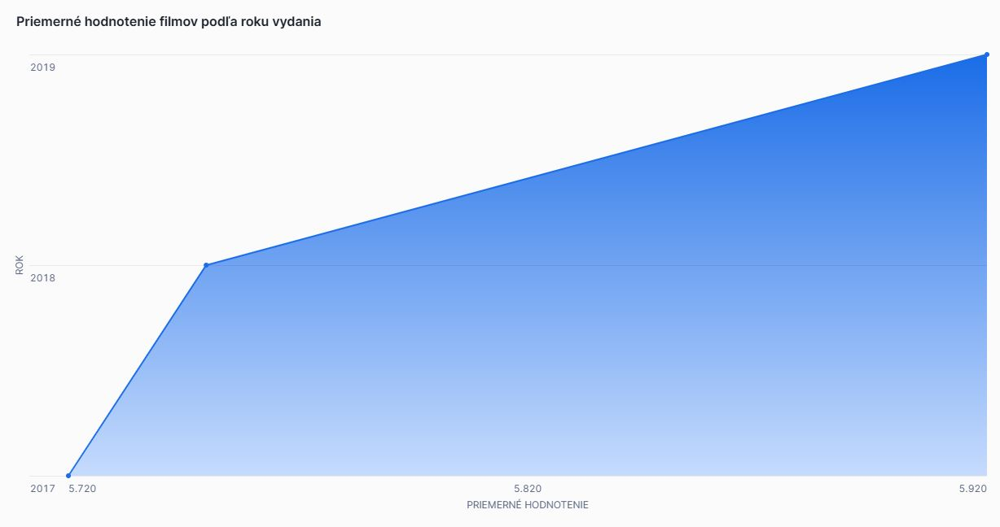
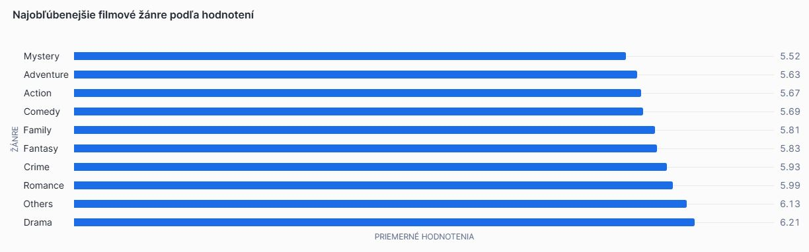
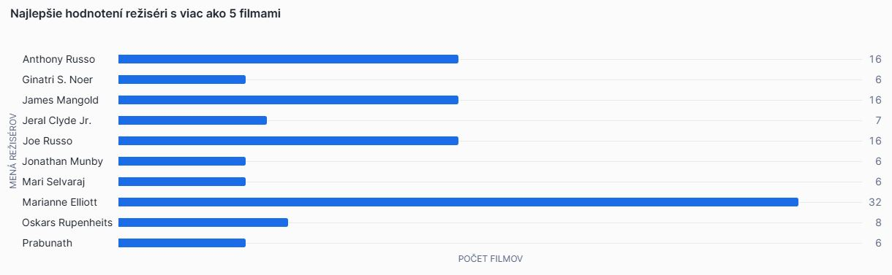
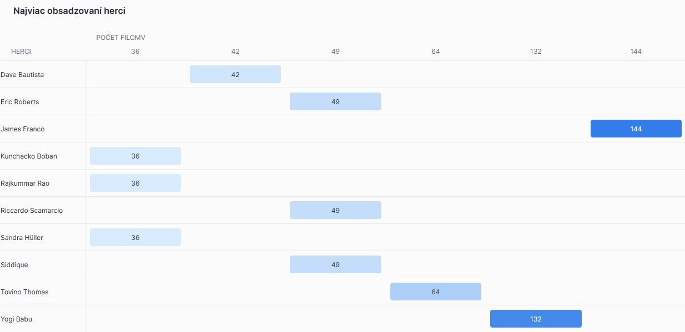
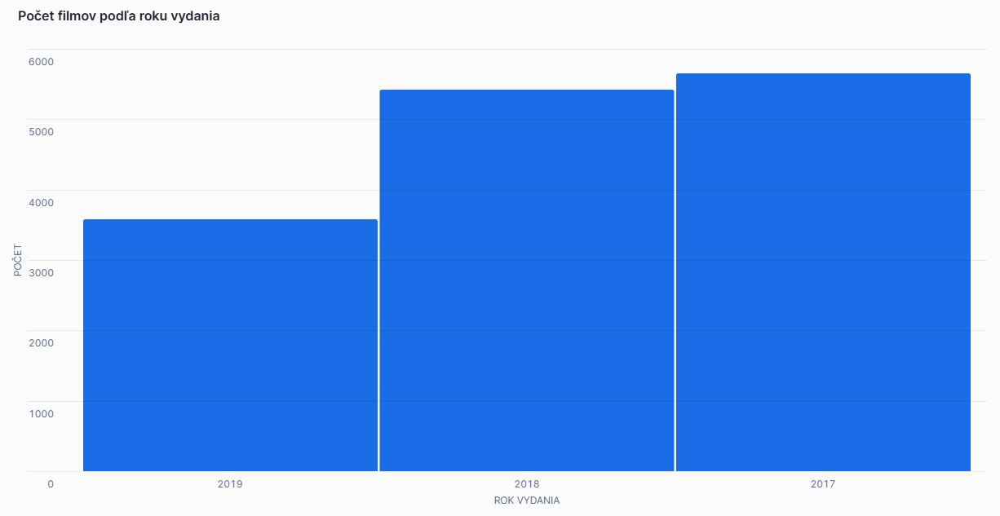

# ETL Proces datasetu IMDB v Snowflake

Tento repozitár obsahuje implementáciu ETL procesu v Snowflake pre analýzu dát z datasetu IMDB. Projekt sa zameriava na preskúmanie informácií o filmoch, hercoch, žánroch a hodnoteniach. Výsledný dátový model umožňuje multidimenzionálnu analýzu a vizualizáciu kľúčových metrík.

## 1. Úvod a popis zdrojových dát

Cieľom projektu je analyzovať dáta týkajúce sa filmov a ich hodnotenia, ako aj informácie o hercoch a réžiséroch. Táto analýza umožňuje identifikovať najpopulárnejšie filmy, najčastejšie žánre a réžisérov s najväčším počtom režírovaných filmov.

Zdrojové dáta obsahujú tieto tabuľky:

- **movie** – obsahuje informácie o filmoch (názov, rok vydania, krajina, jazyk, produkčná spoločnosť).
- **names** – obsahuje informácie o hercoch a réžiséroch (meno, dátum narodenia, známe filmy).
- **director_mapping** – spája filmy s réžisérmi.
- **role_mapping** – spája filmy s hercami.
- **ratings** – obsahuje hodnotenia filmov (priemerné hodnotenie, počet hlasov).
- **genre** – obsahuje žánre jednotlivých filmov.

## 1.1 Dátová architektúra

**ERD diagram**  


---

## 2. Dimenzionálny model

Dimenzionálny model bol navrhnutý tak, aby umožňoval efektívnu analytiku filmových dát. Použitá je hviezdicová schéma (Star Schema), kde faktová tabuľka obsahuje metriky o hodnoteniach filmov a dimenzie poskytujú kontext pre analýzu.

## Faktová tabuľka: `fact_ratings`

| Stĺpec          | Typ         | Popis |
|----------------|------------|------------------------------|
| avg_rating   | DECIMAL(3,1) | Priemerné hodnotenie filmu |
| total_votes  | INT        | Celkový počet hlasov |
| median_rating| INT        | Mediánové hodnotenie filmu |
| Actor_id     | VARCHAR(10) | Identifikátor herca |
| Director_id  | VARCHAR(10) | Identifikátor režiséra |
| dim_id_movies | VARCHAR(10) | Identifikátor filmu |
| dim_datesid  | INT        | Identifikátor dátumu hodnotenia |

## Dimenzie

#### dim_movies

| Stĺpec          | Typ          | Popis |
|----------------|-------------|---------------------------|
| dim_id_movies | VARCHAR(10) | Identifikátor filmu |
| movie_title  | VARCHAR(200) | Názov filmu |
| movie_year   | INT         | Rok vydania |
| date_published | DATE        | Dátum vydania |
| movie_country | VARCHAR(250) | Krajina |
| income       | VARCHAR(30)  | Príjmy z filmu |
| languages    | VARCHAR(200) | Jazyky vo filme |
| company      | VARCHAR(200) | Produkčná spoločnosť |
| genre        | VARCHAR(20)  | Žáner filmu |


#### dim_dates

| Stĺpec        | Typ  | Popis |
|--------------|------|----------------------|
| dim_datesID | INT  | Identifikátor dátumu |
| date       | DATE | Dátum vydania filmu |
| day        | INT  | Deň v mesiaci |
| dayOfWeek  | INT  | Deň v týždni |
| DayOfWeek_String | VARCHAR(10) | Názov dňa |
| week       | INT  | Číslo týždňa |
| month      | INT  | Číslo mesiaca |
| month_String | VARCHAR(10) | Názov mesiaca |
| year       | INT  | Rok |

#### dim_names_actor

| Stĺpec          | Typ          | Popis |
|----------------|-------------|---------------------------|
| name_id      | VARCHAR(10) | Identifikátor herca |
| name        | VARCHAR(100) | Meno herca |
| date_of_birth | DATE        | Dátum narodenia |
| known_for_movies | VARCHAR(100) | Najznámejšie filmy |
| category      | VARCHAR(10)  | Kategória roly |


#### dim_names_director

| Stĺpec         | Typ          | Popis |
|---------------|-------------|---------------------------|
| name_id     | VARCHAR(10) | Identifikátor režiséra |
| name       | VARCHAR(100) | Meno režiséra |
| date_of_birth | DATE        | Dátum narodenia |
| known_for_movies | VARCHAR(100) | Najznámejšie filmy |


---

## 3. ETL proces v Snowflake

ETL proces pozostával z troch hlavných fáz: **extrahovanie (Extract)**, **transformácia (Transform)** a **načítanie (Load)**. Tento proces bol implementovaný v Snowflake s cieľom pripraviť zdrojové dáta zo staging vrstvy do viacdimenzionálneho modelu vhodného na analýzu a vizualizáciu.

## **3.1 Extract (Extrahovanie dát)**

Dáta zo zdrojového datasetu (formát `.csv`) boli najprv nahraté do **Snowflake** prostredníctvom interného stage úložiska s názvom `HEDGEHOG_stage`.  
Stage v **Snowflake** slúži ako dočasné úložisko na import alebo export dát.  
Vytvorenie stage bolo zabezpečené príkazom:

```sql
CREATE OR REPLACE STAGE HEDGEHOG_stage;
```
---
Do stage boli následne nahraté súbory obsahujúce údaje o filmoch, žánroch, réžiách, rolách, menách a hodnoteniach. Dáta boli importované do staging tabuliek pomocou príkazu COPY INTO. Pre každú tabuľku sa použil podobný príkaz:
---
```sql
COPY INTO movie_staging
FROM @HEDGEHOG_stage/movie.csv  
FILE_FORMAT = (TYPE = 'CSV' FIELD_OPTIONALLY_ENCLOSED_BY = '"' SKIP_HEADER = 1);
```
---
## 3.2 Transformácia dát (Transform)
Transformácie zahŕňali vytvorenie dimenzií a faktovej tabuľky.

#### Dimenzia dim_movies
Obsahuje informácie o filmoch vrátane názvu, roku vydania, krajiny, jazyka a produkčnej spoločnosti.
Táto dimenzia je typu SCD 1, pretože aktualizácie údajov prepíšu pôvodné hodnoty bez uchovania histórie.

```sql
CREATE OR REPLACE TABLE dim_movies AS
SELECT DISTINCT
    m.movie_id,
    m.movie_title,
    m.movie_year,
    m.date_published,
    m.movie_country,
    m.income,
    m.languages,
    m.company,
    g.genre
FROM movie_staging m
LEFT JOIN genre_staging g ON m.movie_id = g.movie_id;
```
#### Dimenzia dim_dates
Obsahuje informácie o dňoch, mesiacoch a rokoch vydania filmov. Keďže údaje o žánroch sa menia veľmi zriedkavo, použili sme typ SCD 1, ktorý prepíše staré hodnoty bez uchovávania historických zmien.

```sql
CREATE OR REPLACE TABLE dim_dates AS
SELECT
    ROW_NUMBER() OVER (ORDER BY CAST(date_published AS DATE)) AS dim_datesID,
    CAST(date_published AS DATE) AS date,
    DATE_PART(day, date_published) AS day,
    DATE_PART(month, date_published) AS month,
    DATE_PART(year, date_published) AS year
FROM movie_staging
WHERE date_published IS NOT NULL;
```
#### Dimenzia dim_names_actor
Obsahuje informácie o hercoch a ich známych filmoch.
Táto dimenzia je typu SCD 1, pretože akékoľvek zmeny údajov budú prepísané bez sledovania histórie.

```sql
CREATE OR REPLACE TABLE dim_names_actor AS
SELECT DISTINCT
    n.name_id,
    n.name,
    n.date_of_birth,
    COALESCE(m.movie_title, n.known_for_movies) AS known_for_movies,
    r.category
FROM name_staging n
INNER JOIN role_mapping_staging r ON n.name_id = r.name_id
INNER JOIN movie_staging m ON r.movie_id = m.movie_id;
```
#### Dimenzia dim_names_director
Obsahuje informácie o réžíroch a ich známych filmoch. Vzhľadom na to, že údaje o hercoch sa môžu občas meniť, ale bez nutnosti sledovania historických zmien, bola zvolená stratégia SCD 1, kde nové údaje nahrádzajú pôvodné.

```sql
CREATE OR REPLACE TABLE dim_names_director AS
SELECT DISTINCT
    n.name_id,
    n.name,
    n.date_of_birth,
    COALESCE(m.movie_title, n.known_for_movies) AS known_for_movies
FROM name_staging n
INNER JOIN director_mapping_staging d ON n.name_id = d.name_id
INNER JOIN movie_staging m ON d.movie_id = m.movie_id;
```
---
Vytvorenie faktovej tabuľky:
Príklad vytvorenia faktovej tabuľky fact_ratings:

```sql
CREATE OR REPLACE TABLE fact_ratings AS
SELECT DISTINCT
    r.avg_rating,
    r.total_votes,
    r.median_rating,
    na.name_id AS Actor_id,
    nd.name_id AS Director_id,
    m.movie_id,
    d.dim_datesid
FROM ratings_staging r
LEFT JOIN dim_movies m ON r.movie_id = m.movie_id
LEFT JOIN dim_dates d ON m.date_published = d.date
LEFT JOIN role_mapping_staging ro ON m.movie_id = ro.movie_id
LEFT JOIN dim_names_actor na ON ro.name_id = na.name_id
LEFT JOIN director_mapping_staging ma ON m.movie_id = ma.movie_id
LEFT JOIN dim_names_director nd ON ma.name_id = nd.name_id;
```
### **3.3 Load (Načítanie dát)**

Po úspešnom vytvorení dimenzií a faktovej tabuľky boli dáta nahraté do finálnej štruktúry. Na záver boli staging tabuľky odstránené, aby sa optimalizovalo využitie úložiska:

```sql
DROP TABLE IF EXISTS movie_staging;
DROP TABLE IF EXISTS genre_staging;
DROP TABLE IF EXISTS director_mapping_staging;
DROP TABLE IF EXISTS role_mapping_staging;
DROP TABLE IF EXISTS name_staging;
DROP TABLE IF EXISTS ratings_staging;
```
## **4. Vizualizácia dát**
Navrhnutých bolo 5 vizualizácií, ktoré poskytujú prehľad o dôležitých metrikách:
---
### 1. Priemerné hodnotenia filmov podľa roku vydania:

```sql 
SELECT 
    d.year, 
    ROUND(AVG(f.avg_rating), 2) AS avg_rating
FROM fact_ratings f
JOIN dim_dates d ON f.dim_datesid = d.dim_datesid
GROUP BY d.year
ORDER BY d.year;
```
  

### 2. Najobľúbenejšie filmové žánre podľa hodnotení:

```sql
SELECT 
    dm.genre, 
    ROUND(AVG(fr.avg_rating), 2) AS avg_rating
FROM fact_ratings fr
JOIN dim_movies dm ON fr.dim_id_movies = dm.dim_id_movies
GROUP BY dm.genre
ORDER BY avg_rating DESC
LIMIT 10;
```
 

### 3. Najlepšie hodnotení režiséri:

```sql
SELECT 
    nd.name AS director_name, 
    COUNT(fr.dim_id_movies) AS movie_count,
    ROUND(AVG(fr.avg_rating), 2) AS avg_rating
FROM fact_ratings fr
JOIN dim_names_director nd ON fr.director_id = nd.name_id
GROUP BY nd.name
HAVING COUNT(fr.dim_id_movies) > 5
ORDER BY avg_rating DESC
LIMIT 10;
```


### 4. Najviac obsadzovaní herci:

```sql
SELECT 
    na.name AS actor_name, 
    COUNT(fr.dim_id_movies) AS movie_count
FROM fact_ratings fr
JOIN dim_names_actor na ON fr.actor_id = na.name_id
GROUP BY na.name
ORDER BY movie_count DESC
LIMIT 10;
```
 

### 5. Počet filmov podľa roku vydania:

```sql
SELECT 
    movie_year, 
    COUNT(*) AS movie_count
FROM dim_movies
GROUP BY movie_year
ORDER BY movie_year;
```


```sql
Autor: Sofia Kučerová
```


